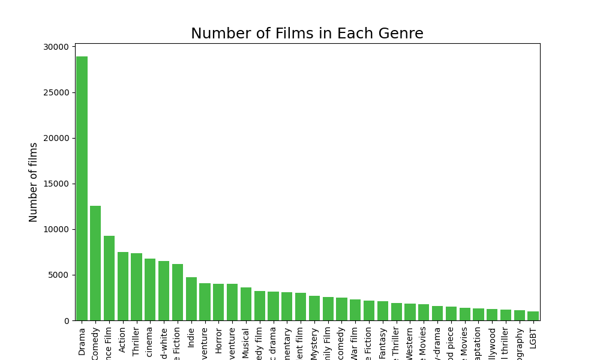

## DATA exploration 
First, we present a general visualization of the data available in the datasets we use. All these pieces of information could be used at some point in the line of analysis presented below.  
We have created a dataset called `Movie`. The `Movie` contains Metadata information originally from the Freebase database that is extracted from the [*CMU Movie Summary Corpus*][CMU] dataset. We added information for each film from the [IMDb Non-Commercial Database][IMDB]. By doing so, we have in our possession a single dataset of approximately 61000 films, where for each film we have information such as the genres, ratings, directors, etc. 
In parallel, we have created another dataset called `Actor` from the *CMU Movie Summary Corpus*. This dataset has for index one actor and has for features every films that he plaid in, at which age, and there is also other features. 
### Here below how to proper implement a picture

The class is the name you want to put at your image if the image is not showing. 

You can adjust the size of the image by adjusting the width 

    

### How to put mathematical equation 

Typically, you should write like this $$10^5$$ and not like this $10^5$.

## Quizz: Who has done the Impossible?

Who do you think has played in 9 different languages throughout their career?

-  **a)** Tom Cruise  
-  **b)** Jean Dujardin  
-  **c)** Jackie Chan  
-  **d)** No one can have done that  

---

#### Reveal the Answer  

  
Click to show the answer

  
  

    
    

      <strong>Correct Answer:</strong> <strong>c) Jackie Chan</strong> 
      Fun fact: Jackie Chan has acted in multiple languages, including Cantonese, Mandarin, English, Korean, Japanese, and more!
    

  

  

## Try to plot an interactive graph (2nd test)

Here below how to plot easely an interactive plot, 100% size 

 

## Plot interactive plot but not 100% size 

If you want to reduce the size, copy paste the code below, here the scaling factor is 0.8, but in can be adjustable in the following path: assets/css/beautifuljekyll.css and on this file, go at the end (line 1200 smth) and on .plot-scale, change transform: scale(0.8) with the size you want. 

   

## Try image time scrolling

Click on the `start` button to see the evolution of the newtork over time. 

    

<button id="action-button"> start </button>

## Try something else 

This example lets you select an image from a dropdown, and it displays the image dynamically.

---

  <h4 style="color: black; text-align: center;">Do actors who have performed in a particular language also perform in other languages? </h4>
  

  

    <label for="choice">Select an language:</label>
    <select id="choice" onchange="changeImage()" style="padding: 5px; margin-left: 10px;">
      <option value="English Language">English</option>
      <option value="French Language">French</option>
      <option value="Hindi Language">Hindi</option>
      <option value="Italian Language">Italian</option>
      <option value="Spanish Language">Spanish</option>
    </select>
  

  

    
Image will appear here

  

------------------------------------------------------------------------------------------------------------------------------------
# Plot 1 :
## alternative 1

  

    <iframe src="assets/img/histogramEnglish.html" style="width:100%; height:300px; border:none;"></iframe>
  

  

    <iframe src="assets/img/histogramHindi.html" style="width:100%; height:300px; border:none;"></iframe>
  

  

    <iframe src="assets/img/histogramSpanish.html" style="width:100%; height:300px; border:none;"></iframe>
  

  

    <iframe src="assets/img/histogramFrench.html" style="width:100%; height:300px; border:none;"></iframe>
  

  

    <iframe src="assets/img/histogramItalian.html" style="width:100%; height:300px; border:none;"></iframe>
  

  

    <iframe src="assets/img/histogramGerman.html" style="width:100%; height:300px; border:none;"></iframe>
  

## alternative 2:

  <h4 style="color: black; text-align: center;">Do actors who have performed in a particular language also perform in other languages? </h4>
  

  

    <label for="choice1">Select a language:</label>
    <select id="choice1" onchange="changeImageHTML()" style="padding: 5px; margin-left: 10px;">
      <option value="histogramEnglish">English</option>
      <option value="histogramFrench">French</option>
      <option value="histogramHindi">Hindi</option>
      <option value="histogramItalian">Italian</option>
      <option value="histogramSpanish">Spanish</option>
    </select>
  

  

    
Select a language !

  

## Plot 2

  

## Plot 3

    

------------------------------------------------------------------------------------------------------------------------------------
[CMU]: https://www.cs.cmu.edu/~ark/personas/
[IMDB]: https://developer.imdb.com/non-commercial-datasets/
[img1]: /assets/img/distribution-film.png
[img2]: /assets/img/nbr-film-genre.png
[img3]: /assets/img/nbr-film-country-origin.png
[img4]: /assets/img/most-rpz-ethnic.png
[img5]: /assets/img/distribution-actor-gender.png
[img6]: /assets/img/distribution-actor-director-DoB.png
[img7]: /assets/img/distribution-actor-director-age-movie.png
[img8]: /assets/img/distribution-actor-director-age-1-film.png
[img9]: /assets/img/distribution-nbr-film-actor-director.png
[img10]: /assets/img/network_with_languages.png
