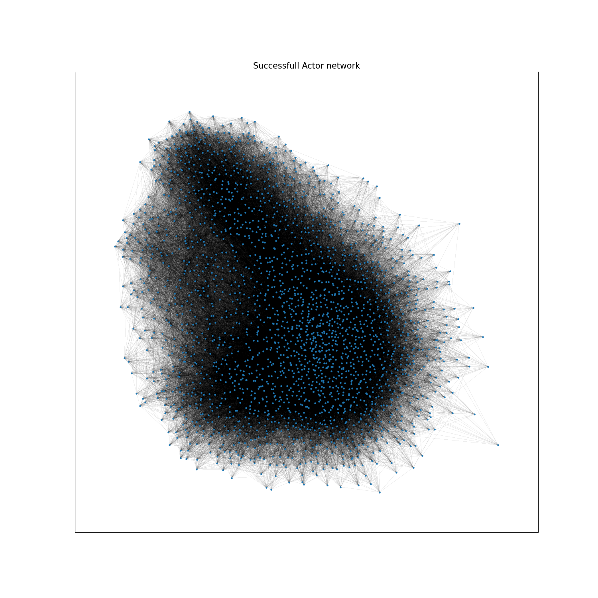

 

## Introduction 

Scientists, let’s talk about networking. Oh, not the kind where you trade research ideas over stale coffee at conferences – no, this is Hollywood-level networking. You may think publishing papers and climbing the academic ladder is tough, but imagine trying to make it in the world of cinema. In both science and film, it seems like knowing the right people can open doors that talent alone cannot.

So, let’s ask ourselves: what does it take to land the lead role? A jaw-dropping audition? An exceptional physique?  Sure, but let’s be honest – your CV might need more social proof than anything else. For actors, the “connections” game isn’t just LinkedIn endorsements; it’s sharing the screen, the limelight, and the credit scroll with other stars.

Career analysis, gender inequality, relationships with directors and language barriers are just some of the obstacles on the road to the red carpet. Let's use some data analysis magic to unravel the codes and secrets of the cinematic universe ! 

<b>"Ready, Set, Action!" Let the data speak!</b>

  

  

 

## Career Profile

First step: career profiles! By charting the number of films each actor has appeared in every year since their career began, we’ve created career profiles. These profiles capture the ebbs and flows of their productivity, revealing fascinating insights. This should enable us to differentiate between the Weekend actor who made a film with his cousin and the Hollywood legend. They take very different shapes and magnitude, highlighting some incredible careers. Let’s take a closer look at some of these extraordinary journey. Let's see who is the most prolific actor of the century.

  
  <!-- Conteneur de l'iframe -->
  

    <iframe src="assets/img/career_Mel Blanc.html" style="width:100%; height:100%; border:none;"></iframe>
  

  
  <!-- Conteneur de l'image -->
  

    
  

  

  
Do you know who is  ?

  
  

    
    

       <strong> Mel Blanc</strong> 
      Mel Blanc was an American voice actor known as "The Man of a Thousand Voices", famous for voicing Bugs Bunny, Daffy Duck, and other iconic <i>Looney Tunes</i> characters.
    

  

  

40 films in one year… that’s impressive! Okay, dubbing is a bit of a cheat ... so here are two career profiles of Hollywood superstars for comparison.

  
  <!-- Conteneur de l'iframe -->
  

    <iframe src="assets/img/career_Johnny Depp.html" style="width:100%; height:100%; border:none;"></iframe>
  

  
  <!-- Conteneur de l'image -->
  

    
  

  

  
More about Uma Thurman ?

  
  

    
    

       <strong> Uma Thurman</strong> 
      Best known for her roles in Quentin Tarantino's <i>Pulp Fiction</i> and the <i>Kill Bill</i> series, Uma Thurman is an acclaimed American actress
    

  

  

  
  <!-- Conteneur de l'iframe -->
  

    <iframe src="assets/img/career_Samuel L. Jackson.html" style="width:100%; height:100%; border:none;"></iframe>
  

  
  <!-- Conteneur de l'image -->
  

    
  

  

  
Further details on Samuel L. Jackson 

  
  

    
    

       <strong> Samuel L. Jackson</strong> 
      Samuel L. Jackson is a highly acclaimed actor renowned for his memorable performances in films such as <i>Star Wars</i> and his portrayal of Nick Fury in the Marvel Cinematic Universe. 	With his commanding presence and iconic voice, he is one of the most influential and prolific actors in Hollywood.
    

  

  

One last example for the road, let's take a Weekend actor. In fact, the data set is mainly made up of profiles similar to that of our fourth candidate. We can't call his career a real one, but we have to consider all those people who have simply tried their hand at acting. 

  
  <!-- Conteneur de l'iframe -->
  

    <iframe src="assets/img/career_Yao Ming.html" style="width:100%; height:300px; border:none;"></iframe>
  

  
  <!-- Conteneur de l'image -->
  

    
  

  

  
Do you know who is Yao Ming ?

  
  

    
    

       <strong> Yao Ming</strong> 
      Yao Ming is a retired Chinese professional basketball player who became an international icon as a dominant center for the Houston Rockets in the NBA. Standing 7'6" (2.29 m) tall, he is known for his exceptional skill, agility, and impact on popularizing basketball in China. He also lent his voice to a character in the animated film <i>The Magic Aster</i> in 2009.
    

  

  

And yes, we're talking about the Chinese NBA basketball player featured in the film *The Magic Aster*!  This data really does have it all.

As much fun as it is to inspect these career profiles by hand, we're going to use the power of clustering algorithms to classify these career types for us. Make way for **unsupervised K-Means**!  
A little **Elbow method** to determine the number of clusters, while keeping the number of clusters low enough to facilitate interpretation... And here are the **centroid** profiles! 

    <iframe src="assets/img/career_with_3_cluster.html" style="width:100%; height:600px; border:none;"></iframe>

That’s nice! It seems that the model has separated the actors into 3 categories. Let’s take a look at their productivity!

  

    <iframe src="assets/img/Total_number_of_filmshisto.html" style="width:100%; height:600px; border:none;"></iframe>
  

  

Just as I thought. The model has separated the actors into 3 different career types:

* **Cluster 0: The One-Time Performers**  
	These individuals have little or no career in acting, often appearing in just one or two projects. Over 45,000 actors (94%) in our dataset fall into this category, accounting for the vast majority.
*	**Cluster 1: The Steady Professionals**  
	These actors enjoy respectable, long-lasting careers (~30 films for 30 years of career) . They may not have reached superstardom, but their contributions are significant. This group comprises around 3,000 actors (5%).
* **Cluster 2: The Superstars**  
  This elite group of just over 200 actors (1%) represents the pinnacle of the industry. They boast prolific filmographies and careers spanning decades (~70 films for 50 years of career).

Now, let’s dig deeper into these clusters. First question: is there truth to the stereotype that superstars are all good-looking, in their mid-thirties, and 1.80 meters tall? We can’t measure attractiveness here, but let’s check out height and age distributions at the start of their careers.

    <iframe src="assets/img/actor_heighthisto.html" style="width:100%; height:100%; border:none;"></iframe>

  

    <iframe src="assets/img/Career_Start_agehisto.html" style="width:100%; height:100%; border:none;"></iframe>
  

The 1.80m cliché? Busted, a **Student's t-test** backs it up. Nevertheless, extremes in height are less common among actors as in the global population. While there are exceptions, like superstars representing communities with dwarfism (e.g., Kenny Baker and Billy Barty), taller individuals—like basketball players (Yao, we see you!)—do seem to face challenges.
But what about starting young? That’s a different story. Look at the data—early starters often have an edge over late-arrival, provided they stick with it long enough to transition into adult roles!

  

    <iframe src="assets/img/Career_lengthhisto.html" style="width:100%; height:100%; border:none;"></iframe>
  

Career length confirms it: longevity is key to joining the ranks of the greats. Meanwhile, over 40% of Weekend actors play for just a single year!
Unfortunately, not all the findings are uplifting. When examining gender disparities, the results are disheartening. Let's see what the data say: 

    <iframe src="assets/img/gender_camembert_cluster.html" style="width:100%; height:100%; border:none;"></iframe>

  

 A **Chi-squared** reveals a stark imbalance: women are severely underrepresented among the most prolific actors. This disparity highlights a systemic issue in the film industry, one that calls for reflection and action.

 

## Actors/Directors relations

What interesting findings and fun facts about the career of actors have we covered. But enough talking about actors, they already have enough glory. We only think about them when we think about movies and it is quite natural as we literally see them for 2 hours straight. However, a movie is not only made with people on the screen. A lot of people are working on it in the shadow. Indeed, if a movie is made, it is because someone had an idea for a script and a will to create something. This person is the **director**, the pillar of every movie.

### Successful actor

As you guessed it, this part is oriented to the directors and especially famous directors. The goal will be to analyze the relation between **successful actors** and the **directors** and finally to identify different types of directors based on our findings. But before dwelling into famous and successful directors (or maybe bad directors), we must first determine the successful actors. This sounds easy right, when you read « successful actors », I am pretty sure a short list of names popped into your head. Unfortunately, we are data analyst and we need more than just a list of names, we need precise criteria that are valid and can be applied for all actors (*boring right !?*).  

Fortunately, the careers of actors were previously analyzed in the previous section, this help characterise the actors. Later on, we created a huge network of actors. The connections between actors were determined based on their participation in the same movie. Additionally, specific criteria for defining a successful actor were established and refined after further analysis. Here is the list of these criteria :
1. **Minimum number of films** : 12 movies
2. **Eigen-vector centrality** : above the average eigen-vector centrality of the network 
3. **Ratings** : above the mean ratings of their specific movie genre

    

### Bipartite Directed Graph

After applying this list of criteria to the original list of actors, approximately 2300 actors were labelled as successful. This represent less than 2% of the original number of actors (yes, not everyone is successful, sorry you had to hear that here). We can finally start playing with the directors of films. In order to determine the relevant directors with respect to these actors, a **directed bipartite graph** between actors and directors was computed. That’s a lot of complicated words for something really simple, here is the explanation : 
- **Structure**: 
    - Nodes represent actors and directors.  
    - Directed edges flow from actors to directors.  
    - An edge exists if an actor and a director have worked together.  
- **Edge Weight**: Represents the number of films they collaborated on.  
- **Director Node Value**: The sum of edge weights directed to each director.  

By creating this graph, a list of directors related to successful actors was done. As an image is worth a 1000 words, here are 4000 words :

  <h4 style="color: black; text-align: center;">Bipartite directed graph for a single director</h4>
  

  

    <label for="choice">Select a Director:</label>
    <select id="choice" onchange="changeImage()" style="padding: 5px; margin-left: 10px;">
      <option value="alex_def2">Ingmar Bergman</option>
      <option value="Alex_def4">Francis Ford Coppola</option>
      <option value="Alex_def1">Ernest Pintoff</option>
      <option value="Alex_def3">Takeshi Kitano</option>
    </select>
  

  

    
Select a director !

  

Now that you have understood and visualized the graph, let’s do a little quizz interlude :   

#### Quizz:
Who do you think is the most feed directors among these four directors : Quentin Tarantino, Stanley Kubrick, Francis Ford Coppola, Woody Allen ? What do you think is the ranking ?

-  **a)** Quentin Tarantino  
-  **b)** Stanley Kubrick  
-  **c)** Francis Ford Coppola  
-  **d)** Woody Allen  

---

  
Click to show the answer

  
  

    
    

      <strong>Woody Allen</strong> 
	    <ul>
		<li>Woody Allen is the most fed director among all directors: total weight of 302</li>
		<li>Francis Ford Coppola: 162</li>
	  	<li>Quentin Tarantino: 76</li>
	  	<li>Stanley Kubrick: 58</li>
	</ul>
    

  

  

#### Quizz:
Which actor has the mode weighted edge ? In other words, which actor has worked the most with the same director ? 

---

  
Click to show the answer

  
  

    
    

      <strong>Again, Woody Allen</strong> 
	Woody Allen played 28 times with the same director, impressive link right ? Well the director in question was...... HIMSELF. He directed and played in its movie 28 times, pretty handy right. 
    

  

  

### Type of directors

We choose to show the **directed graph** of this four directors for specific reasons (not just only because we did a df.sample(), we are professional). Like actors, directors have different careers and behave differently. Indeed, this can be easily noticed by the difference in the four previous graph. Hence, an interesting thing to do is to categorize and classify type of directors. You guessed it, we are going to do clustering once more. This brings us to the next step of our director’s journey : **Kmeans**. Let’s dive into it :

- Cluster 2 - **Bad directors** : The directors in this cluster are not good at what they do. They have all the red flags : few movies, low occurrences of working with a successful actor and a low ratings of theirs movie (below average). 
- Cluster 3 - **"Few movies but high ratings" Directors** : These directors have worked with a few successful actors and they have directed not that many movies.  However, each of theirs movie is a hit and has a high rating.
- Cluster 0 - **"Lot movies and good ratings" Directors** : These directors have prolific careers with and without successful actors. They make a lot of movies and have an overall high ratings. 
- Cluster 1 - **"Lot movies and good ratings" Directors + Successful Actors** : These one are *la crème de la crème*. They have made a lot of movies with high rating like the directors in the previous clusters but they have directed a lot of successful actors. They are the one who shaped cinema. 

    <iframe src="assets/img/Alex_Plot_Camembert_Kmeans.html" style="width:100%; height:100%; border:none;"></iframe>

Are you able to guess which category belongs each of our previous directors ?
- Cluster 2 - **"Bad" directors** is Ernest Pintoff
- Cluster 3 - **"Few movies but high ratings" Directors** is Takeshi Kitano
- Cluster 0 - **"Lot movies and good ratings" Directors** is Ingmar Bergman
- Cluster 1 - **"Lot movies and good ratings" Directors + Successful Actors** is Francis Ford Coppola

We can now analyse the differences between cluster with the help of beautiful graphs to better comprehend their characteristics.

    <iframe src="assets/img/Alex_Plot_NOA_Vs_Sum_Weight_Director_Cluster.html" style="width:100%; height:600px; border:none;"></iframe>

As expected as we rise through the quality of directors, the directors gain in total weight as well as in number of edge (i.e. successful actors). As can be seen, the bad directors and the one with a few movies are similar as they both have less weight and less edge. They are linked in this aspect and are similar.

    <iframe src="assets/img/Alex_Plot_NOF_Vs_Sum_Weight.html" style="width:100%; height:600px; border:none;"></iframe>

The separation between each cluster is also well defined in the above plot. As expected, after a certain number of movie or weight, you are directly labelled in cluster 0 or 1. Nevertheless, the number of movie is not a hard criterion for being into cluster 1, it is necessary that you encounter a lot of successful actors in your career. Once more, cluster 2 and 3 overlapped due to their similarities in their number of films or total weight.

    <iframe src="assets/img/Alex_Plot_Mean_Rating_Director_Cluster.html" style="width:100%; height:600px; border:none;"></iframe>

The true difference between cluster 2 and cluster 3 shines in their average ratings, as can be seen from the plot above. The *bad director* are not labelled as bad for no reason, their average rating goes from 3 to 5.8, whereas the rest are almost all above 6. Indeed, the rest of the directors linked to successful actors performed well in their movies and acquire high ratings.

    <iframe src="assets/img/Alex_Plot_NOF_Vs_Career_Start.html" style="width:100%; height:600px; border:none;"></iframe>

Finally, by comparing the number of films directed and the career starting age, it seems that the best time to begin one's career is between 20 and 35 year old. However, this will not impact your success in your career. Once more, it can be noticed that cluster 2 and 3 seems to have less films registered due to shorter career for the bad directors or few movies for the cluster 3. Moreover, this plot motivate once more the link with the number of movies performed by each cluster. The bad director did not work on a lot of movies, potentially due to their bad performance. 

 

## Networking through languages

But hey, now that we’ve got a good grasp of networks, here’s a new question for you : What do you think ties these actors together ?
**Language, my friend !** Language barriers have always played a big role in shaping connections. So, let’s see if our stars are under the same spell.

We built a **network** of co-actors, used a spring layout to arrange it, and colored the nodes by language. Voilà, the result is in!

    

Two strikingly distinct groups pop right out, don’t they? It’s the ultimate battle of cinematic giants: Hollywood and Bollywood, sweeping nearly every other culture into their orbits. On one side, English reigns supreme, with small but noticeable patches of French and Italian carving out their niches alongside the American juggernaut. On the other side, the vibrant dominance of Indian and South Asian languages paints a vivid picture of Bollywood's reach.

Even though the separation may seem pretty intense, let’s take a step back and appreciate the multicultural side of the actors. A significant number of them work across different languages, bridging cultures through their performances. So, here’s the big question: which of the most widely spoken languages do you think go hand in hand the most often?

  <h4 style="color: black; text-align: center;">Which languages work as pairs ? </h4>
  

  

    <label for="choice1">Select a language:</label>
    <select id="choice1" onchange="changeImageHTML()" style="padding: 5px; margin-left: 10px;">
      <option value="histogram_English">English</option>
      <option value="histogram_French">French</option>
      <option value="histogram_Hindi">Hindi</option>
      <option value="histogram_Italian">Italian</option>
      <option value="histogram_Spanish">Spanish</option>
    </select>
  

  

    
Select a language !

  

The results are telling: while European languages are often paired, multiculturalism is not the main concern of Hollywood and Bollywood. Over 70% of actors that played in English stick exclusively to English with only 2% of Indie speaker. On the other hand, more than 80% of Indian actors primarily act in Hindi or English, reflecting the clustering of Bollywood and the influence of globalization. 
English really comes into its own as the international language here. With an impressive 75% of all films showcasing Shakespeare's language, English has become the undeniable lingua franca of cinema. It acts as a bridge between cultures, enabling actors and audiences from all over the world to connect.

To come full circle, let’s use the clusters derived from our career profiles to explore the importance of establishing oneself as an international actor. This time, we’ll divide the dataset into two groups:

- **The One-Time Performers** : Actors with brief or no careers, appearing in only one or two projects. (Career cluster 0)
- **Career Actors** : Actors that stand out for their long and impactful careers, from steady professionals to prolific superstars, leaving a lasting mark on the industry. (Career cluster 1 and 2)

Let's see the proportion of actors who have worked in various languages to measure the multiculturalism of the most prolific actors. And the results? They’re a celebration of diversity!

    <iframe src="assets/img/group_distribution_plot.html" style="width:100%; height:100%; border:none;"></iframe>

Ah, the victory of multiculturalism! Career actors often expand their horizons by working across multiple cultures. The big loser in this game is Indie cinema, which, despite its high productivity, rarely features prominently in the careers of long-term actors. Meanwhile, English dominates the field, appearing in nearly every actor’s porfolio.

#### Quizz: Who has done the Impossible?

Who do you think has played in 9 different languages throughout her/his career?

-  **a)** Meryl Streep
-  **b)** Jean Dujardin  
-  **c)** Jackie Chan  
-  **d)** No one can have done that  

---

#### Reveal the Answer  

  
Click to show the answer

  
  

    
    

      <strong>Correct Answer:</strong> <strong>c) Jackie Chan</strong> 
      Fun fact: Jackie Chan has acted in multiple languages, including Cantonese, Mandarin, English, Korean, Japanese, and more!
    

  

  

 

## Conclusion

We've come to the end of our journey into the exciting world of careers and relationships in the film industry. Harnessing the power of K-means clustering, t-tests and chi-squared, directed graphs and network analysis, the data revealed some fascinating insights. First of all, you don't need to be 1m80 tall for your career to take off. Instead, learn other languages and try to export yourself abroad. (Start with English) Ah, and the fight for gender equality in cinema still has a lot of work to do... lastely just because you work with successful people doesn't mean you're a successful person. 

<b>I hope you enjoyed reading this, have a Merry Christmas!</b>

  

[CMU]: https://www.cs.cmu.edu/~ark/personas/
[IMDB]: https://developer.imdb.com/non-commercial-datasets/
[img1]: /assets/img/distribution-film.png
[img2]: /assets/img/nbr-film-genre.png
[img3]: /assets/img/nbr-film-country-origin.png
[img4]: /assets/img/most-rpz-ethnic.png
[img5]: /assets/img/distribution-actor-gender.png
[img6]: /assets/img/distribution-actor-director-DoB.png
[img7]: /assets/img/distribution-actor-director-age-movie.png
[img8]: /assets/img/distribution-actor-director-age-1-film.png
[img9]: /assets/img/distribution-nbr-film-actor-director.png
[img10]: /assets/img/network_with_languages.png
