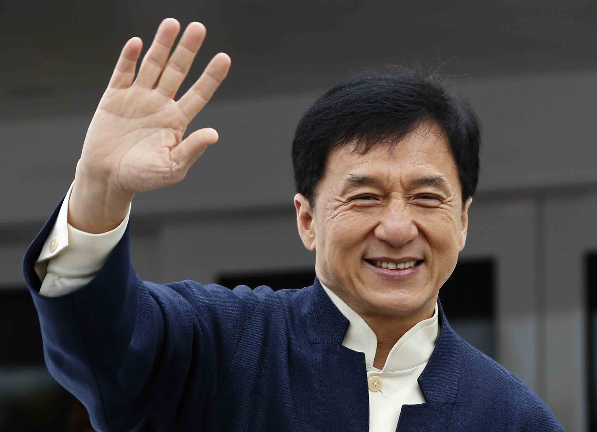
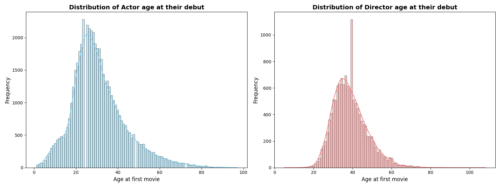

## DATA exploration 
First, we present a general visualization of the data available in the datasets we use. All these pieces of information could be used at some point in the line of analysis presented below.  
We have created a dataset called `Movie`. The `Movie` contains Metadata information originally from the Freebase database that is extracted from the [*CMU Movie Summary Corpus*][CMU] dataset. We added information for each film from the [IMDb Non-Commercial Database][IMDB]. By doing so, we have in our possession a single dataset of approximately 61000 films, where for each film we have information such as the genres, ratings, directors, etc. 
In parallel, we have created another dataset called `Actor` from the *CMU Movie Summary Corpus*. This dataset has for index one actor and has for features every films that he plaid in, at which age, and there is also other features. 
### Distribution of data in the Movie dataset
The dataset contains films between 1910 and 2020. We observe almost twice as many films as usual in the 2000-2015 period.
![Distribution of Film Release Dates][img1]
634 different genres are present. We would typically consider only the 10 most popular genres in our analysis.
![Number of Films in Each Genre][img2]
145 different countries of origin are present in the dataset. We could group certain countries together (such as European or African countries, for example) to consider only the ~10 most prolific countries. Another possibility is to group the countries by their continent for the analysis.
![Number of Movies by Country of Origin][img3]
### Distribution of data about actors and directors
After reconverting the ethnicity data, we conclude that we won't be able to do any further analysis using ethnicity as we only have this information for less than 6% of actors. We could typically focus the analysis on the most popular actors (larger networks/careers). We would then double-check whether information on the ethnic origin of this subset of actors could be used.
![Most represented ethnic groups][img4]
We have a clear imbalance between actor's gender in the dataset with 45 % Male and only 26 % Female. Note that we lack this information for 29% of actors.
![Distribution of Actor Genders][img5]
The dataset includes actors and directors born between 1850 and 2000, reaching a maximum around 1970.
![Distribution of Actor Birth Years][img6]
Keeping track of the ages of the directors and actors during their careers could be interesting. As for ages at movie release, the data is nicely distributed for both actors and directors. We can observe that directors are typically older than the actors. 
![Distribution of Actor ages at Movie Release][img7]
We then plot the ages of the director and actor at their debut :
![Distribution of Actor age at their debut][img8]
Both distributions have the same shape but we observe that the director distribution is less spread out. The most represented age is around 25 years old for the actors and 37 years old for the directors.  
Then we plot the number of films directed/played by directors/actors.
![Distribution of number of films per actor][img9]
Typically, the graph for the actor shows that around $$10^5$$ actors have played in one single film, around $$2 \times 10^4$$ have played in only two different films,... These two curves are as expected decreasing pretty fast : directors who have directed more than 50 movies or actors who have played in more than 100 movies are isolated cases.  We can notice that directors tend to participate in fewer films than actors.

Now that we have a more clear view on our database, lets begin the analysis.

## Quizz: Who has done the Impossible?

Who do you think has played in 9 different languages throughout their career?

-  **a)** Tom Cruise  
-  **b)** Jean Dujardin  
-  **c)** Jackie Chan  
-  **d)** No one can have done that  

---

#### Reveal the Answer  

  
Click to show the answer

  
  

    
    

      <strong>Correct Answer:</strong> <strong>c) Jackie Chan</strong> 
      Fun fact: Jackie Chan has acted in multiple languages, including Cantonese, Mandarin, English, Korean, Japanese, and more!
    

  

  

## Try to plot an interactive graph (2nd test)

 

## Try to plot interactive plot from jupyter notebook
 

## Try image time scrolling

Click on the `start` button to see the evolution of the newtork over time. 

    

<button id="action-button"> start </button>

## Try something else 

This example lets you select an image from a dropdown, and it displays the image dynamically.

---

  <h4 style="color: black; text-align: center;">Put a title here if needed</h4>
  

  

    <label for="choice">Select an image:</label>
    <select 
      id="choice" 
      style="padding: 5px; margin-left: 10px;" 
      onchange="
        var choice = this.value;
        var result = document.getElementById('result');
        if (choice === '') {
          result.innerHTML = '
Image will appear here
';
        } else {
          // Correction: Utiliser le bon type d'image selon son extension
          var imagePath = 'assets/img/' + choice + '.png'; // Mettez ici l'extension correcte (.jpg, .png)
          
          var image = new Image();  // Création dynamique de l'élément Image
          image.src = imagePath; // Définir la source de l'image

          // Clear previous content inside the result div
          result.innerHTML = '';

          // Une fois l'image chargée, ajouter au div result
          image.onload = function() {
            result.appendChild(image); // Ajouter l'image au div result
            // Style l'image pour ajuster parfaitement à l'espace du conteneur
            image.style.width = '100%';  // Redimensionner en largeur
            image.style.height = '100%'; // Redimensionner en hauteur
            image.style.objectFit = 'contain'; // Préserver les proportions de l'image
            image.style.display = 'block';  // Supprimer les espaces ou marges supplémentaires
            image.style.margin = 'auto';  // Centrer l'image horizontalement
          };

          // Gestion des erreurs si l'image échoue à se charger
          image.onerror = function() {
            result.innerHTML = '
Failed to load image
';
          };
        }
      "
    >
      <option value="English_Language">English</option>
      <option value="French_Language">French</option>
      <option value="Hindi_Language">Hindi</option>
      <option value="Italian_Language">Italian</option>
      <option value="Spanish_Language">Spanish</option>
    </select>
  

  

    
Image will appear here

  

[CMU]: https://www.cs.cmu.edu/~ark/personas/
[IMDB]: https://developer.imdb.com/non-commercial-datasets/
[img1]: /assets/img/distribution-film.png
[img2]: /assets/img/nbr-film-genre.png
[img3]: /assets/img/nbr-film-country-origin.png
[img4]: /assets/img/most-rpz-ethnic.png
[img5]: /assets/img/distribution-actor-gender.png
[img6]: /assets/img/distribution-actor-director-DoB.png
[img7]: /assets/img/distribution-actor-director-age-movie.png
[img8]: /assets/img/distribution-actor-director-age-1-film.png
[img9]: /assets/img/distribution-nbr-film-actor-director.png
