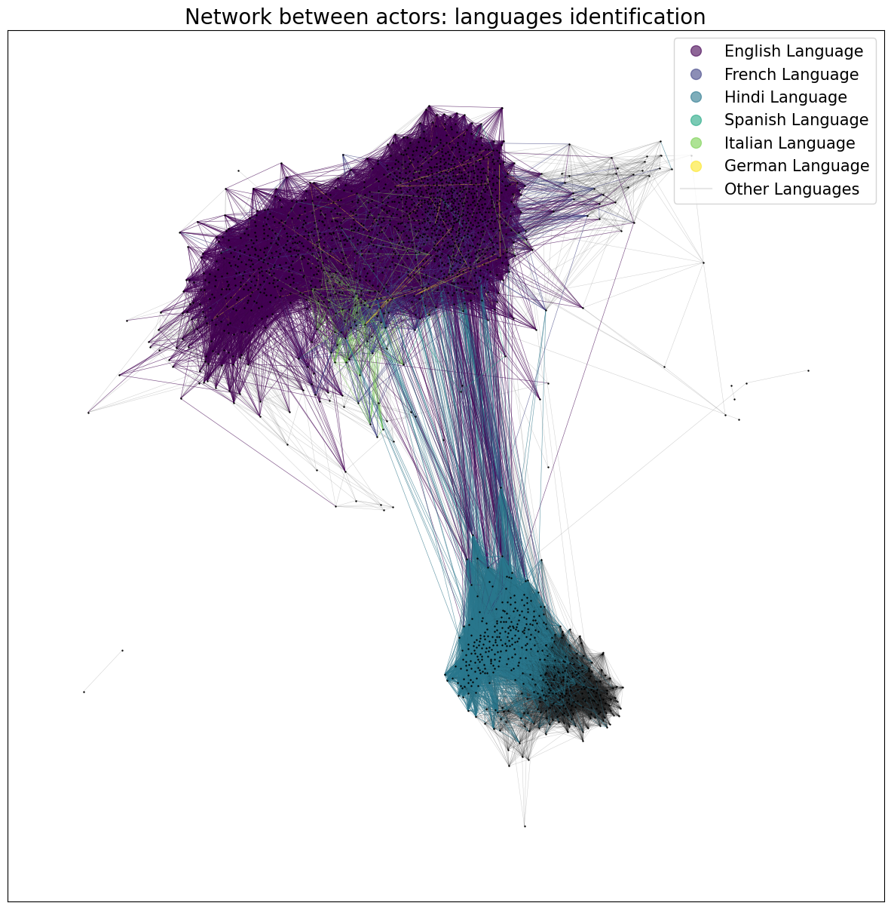

## DATA exploration 
First, we present a general visualization of the data available in the datasets we use. All these pieces of information could be used at some point in the line of analysis presented below.  
We have created a dataset called `Movie`. The `Movie` contains Metadata information originally from the Freebase database that is extracted from the [*CMU Movie Summary Corpus*][CMU] dataset. We added information for each film from the [IMDb Non-Commercial Database][IMDB]. By doing so, we have in our possession a single dataset of approximately 61000 films, where for each film we have information such as the genres, ratings, directors, etc. 
In parallel, we have created another dataset called `Actor` from the *CMU Movie Summary Corpus*. This dataset has for index one actor and has for features every films that he plaid in, at which age, and there is also other features. 

 

## Introduction 

Scientists, let’s talk about networking. Oh, not the kind where you trade research ideas over stale coffee at conferences – no, this is Hollywood-level networking. You may think publishing papers and climbing the academic ladder is tough, but imagine trying to make it in the world of cinema. In both science and film, it seems like knowing the right people can open doors that talent alone cannot.

So, let’s ask ourselves: what does it take to land the lead role? A jaw-dropping audition? An exceptional physique?  Sure, but let’s be honest – your CV might need more social proof than anything else. For actors, the “connections” game isn’t just LinkedIn endorsements; it’s sharing the screen, the limelight, and the credit scroll with other stars.

Career analysis, gender inequality, relationships with directors and language barriers are just some of the obstacles on the road to the red carpet. "Ready, Set, Action!" Let the data speak !

 

## Actor Network: Career

First step: career profiles! By charting the number of films each actor has appeared in every year since their career began, we’ve created career profiles. These profiles capture the ebbs and flows of their productivity, revealing fascinating insights. This should enable us to differentiate between the Sunday actor who made a film with his cousin and the Hollywood star. They take very different shapes and magnitude, highlighting some incredible careers. Let’s take a closer look at some of these extraordinary journey.  Who do you think is the most prolific actor of the decade?

  
  <!-- Conteneur de l'iframe -->
  

    <iframe src="assets/img/career_Mel Blanc.html" style="width:100%; height:100%; border:none;"></iframe>
  

  
  <!-- Conteneur de l'image -->
  

    
  

  

  
Do you know who is Mel Blanc ?

  
  

    
    

       <strong> Mel Blanc</strong> 
      Mel Blanc was an American voice actor known as "The Man of a Thousand Voices," famous for voicing Bugs Bunny, Daffy Duck, and other iconic Looney Tunes characters.
    

  

  

40 films in one year… that’s impressive! Okay, dubbing is a bit of a cheat ... so here are two career profiles of Hollywood superstars for comparison.

  
  <!-- Conteneur de l'iframe -->
  

    <iframe src="assets/img/career_Johnny Depp.html" style="width:100%; height:100%; border:none;"></iframe>
  

  
  <!-- Conteneur de l'image -->
  

    
  

  

  
Do you know who is Johnny Depp ?

  
  

    
    

       <strong> Mel Blanc</strong> 
      Mel Blanc was an American voice actor known as "The Man of a Thousand Voices," famous for voicing Bugs Bunny, Daffy Duck, and other iconic Looney Tunes characters.
    

  

  

  
  <!-- Conteneur de l'iframe -->
  

    <iframe src="assets/img/career_Samuel L. Jackson.html" style="width:100%; height:100%; border:none;"></iframe>
  

  
  <!-- Conteneur de l'image -->
  

    
  

  

  
Do you know who is Mel Blanc ?

  
  

    
    

       <strong> Mel Blanc</strong> 
      Mel Blanc was an American voice actor known as "The Man of a Thousand Voices," famous for voicing Bugs Bunny, Daffy Duck, and other iconic Looney Tunes characters.
    

  

  

One last example for the road, let's take a Sunday actor. In fact, the data set is mainly made up of profiles similar to that of our fourth candidate. We can't call his career a real one, but we have to consider all those people who have simply tried their hand at acting. 

  
  <!-- Conteneur de l'iframe -->
  

    <iframe src="assets/img/career_Yao Ming.html" style="width:100%; height:300px; border:none;"></iframe>
  

  
  <!-- Conteneur de l'image -->
  

    
  

  

  
Do you know who is Mel Blanc ?

  
  

    
    

       <strong> Mel Blanc</strong> 
      Mel Blanc was an American voice actor known as "The Man of a Thousand Voices," famous for voicing Bugs Bunny, Daffy Duck, and other iconic Looney Tunes characters.
    

  

  

And yes, we're talking about the Chinese NBA basketball player featured in the film YYYY!  This data really does have it all.

As much fun as it is to inspect these career profiles by hand, we're going to use the power of clustering algorithms to classify these career types for us. Make way for KNN!  
A little elbow method to determine the number of clusters, while keeping the number of clusters low enough to facilitate interpretation... And here are the centroid profiles! 

  

That's nice! It seems that the model has separated the players into 3 categories. Let's take a look at their productivity!

  

Just as I thought. The model has separated our actors into 3 different career types:

* **Cluster 0: The Sunday Actors**  
	These individuals have little or no career in acting, often appearing in just one or two projects. Over 50,000 actors (percentage) in our dataset fall into this category, accounting for the vast majority.
* **Cluster 1: The Superstars**  
  This elite group of just over 200 actors (percentage) represents the pinnacle of the industry. They boast prolific filmographies and careers spanning decades. “info sur la longueur moyenne et le nombre de films moyen »
*	**Cluster 2: The Steady Professionals**  
	These actors enjoy respectable, long-lasting careers. They may not have reached superstardom, but their contributions are significant. This group comprises around 2,000 actors. (percentage) “info sur la longueur moyenne et le nombre de films moyen »

Let's delve deeper into the analysis of these clusters! The first thing we're going to control is the famous cliché: all superstar are good-looking in their mid-thirties and 1.80 meters tall. We can't control their appearance here, but let's look at their height and age distribution at the start of their careers.

  

    
  

  

    
  

It would seem that the 1m80 shot is wrong and the **Chi2** test is here to confirm it.
But, on  thing can still be notice, the extreme have it harder … With the exception of super stars representing the community of people with dwarfism, such as XXXX or YYYY, it would seem that extremes are less likely to have a career in the cinema. Would it means it’s more difficult for children and basketball players ?  (we remember you, Yao!).
For the very big guys, it seems to be the case, but for children, it's a long way off. Look at the age at which careers begin! Starting early even seems to be an advantage when it comes to building a great career, you just have to stay in the business long enough to stay in it as an adult!

  

This is confirmed even further by looking at career lengths, confirming once again our assumptions about model clusters: a long career ensures a place among the great actors of history! And look at the career length of the Sunday actors ... more than XXX percent of the group only played one year!
Unfortunately, not all the findings are uplifting. When examining gender disparities, the results are disheartening. Let's see what the data say: 

  

 A **t-test** reveals a stark imbalance: women are severely underrepresented among the most prolific actors. This disparity highlights a systemic issue in the film industry, one that calls for reflection and action.

But hey, now that we’ve got a good grasp of networks, here’s a new question for you : What do you think ties these actors together ?
**Language**, my friend ! Language barriers have always played a big role in shaping connections. So, let’s see if our stars are under the same spell. We built a network of co-actors, used a spring layout to arrange it, and colored the nodes by language. Voilà, the result is in!
Two strikingly distinct groups pop right out, don’t they? It’s the ultimate battle of cinematic giants: Hollywood and Bollywood, sweeping nearly every other culture into their orbits. On one side, English reigns supreme, with small but noticeable patches of French and German carving out their niches alongside the American juggernaut. On the other side, the vibrant dominance of Indian and South Asian languages paints a vivid picture of Bollywood's reach.

Now that we have a good idea of how these superstars are, let’s talk about networking and to be more specific, about director-actor connections !

But hey, now that we’ve got a good grasp of networks, here’s a new question for you : What do you think ties these actors together ?
**Language**, my friend ! Language barriers have always played a big role in shaping connections. So, let’s see if our stars are under the same spell. We built a network of co-actors, used a spring layout to arrange it, and colored the nodes by language. Voilà, the result is in!
Two strikingly distinct groups pop right out, don’t they? It’s the ultimate battle of cinematic giants: Hollywood and Bollywood, sweeping nearly every other culture into their orbits. On one side, English reigns supreme, with small but noticeable patches of French and German carving out their niches alongside the American juggernaut. On the other side, the vibrant dominance of Indian and South Asian languages paints a vivid picture of Bollywood's reach.

    

Even though the separation may seem pretty intense, let’s take a step back and appreciate the multicultural side of our actors. A significant number of them work across different languages, bridging cultures through their performances. So, here’s the big question: which of the most widely spoken languages do you think go hand in hand the most often?

  <h4 style="color: black; text-align: center;">Do actors who have performed in a particular language also perform in other languages? </h4>
  

  

    <label for="choice1">Select a language:</label>
    <select id="choice1" onchange="changeImageHTML()" style="padding: 5px; margin-left: 10px;">
      <option value="histogram_English">English</option>
      <option value="histogram_French">French</option>
      <option value="histogram_Hindi">Hindi</option>
      <option value="histogram_Italian">Italian</option>
      <option value="histogram_Spanish">Spanish</option>
    </select>
  

  

    
Select a language !

  

The results are telling: while European languages are often paired, multiculturalism is not the main concern of Hollywood and Bollywood. Over XX% of actors that played in English stick exclusively to English with only 2% of Indie speaker. On the other hand, more than XX% of Indian actors primarily work in Hindi or English, reflecting the clustering of Bollywood and the influence of globalization. 
English really comes into its own as the international language here. With an impressive XX% of all films available in Shakespeare's language, English has become the undeniable lingua franca of cinema. It acts as a bridge between cultures, enabling actors and audiences from all over the world to connect.

To come full circle, let’s use the clusters derived from our career profiles to explore the importance of establishing oneself as an international actor. First, we’ll divide the dataset into two groups:

- *The One-Time Performers* (Cluster 0)

- *Career Actors* (Clusters 1 and 2)

Next, we calculate the proportion of actors who have worked in various languages to measure the multiculturalism of the most prolific actors. And the results? They’re a celebration of diversity!

  

Ah, the victory of multiculturalism! Career actors often expand their horizons by working across multiple cultures. The big loser in this game is Indie cinema, which, despite its high productivity, rarely features prominently in the careers of long-term actors. Meanwhile, English dominates the field, appearing in nearly every actor’s CV (XX%).

#### Conclusion

We've come to the end of our journey into the exciting world of careers and relationships in the film industry. Harnessing the power of K-means clustering, t-tests and chi2, directed graphs and network analysis, the data revealed some fascinating insights. First of all, you don't need to be 1m80 tall for your career to take off. Instead, learn other languages and try to export yourself abroad. (Don't start with English) Ah, and the fight for gender equality in cinema still has a lot of work to do... and just because you work with successful people doesn't mean you're a successful person. 
I hope you enjoyed reading this, have a Merry Christmas and long live ADA!

### How to put mathematical equation 

Typically, you should write like this $$10^5$$ and not like this $10^5$.

## Quizz: Who has done the Impossible?

Who do you think has played in 9 different languages throughout their career?

-  **a)** Tom Cruise  
-  **b)** Jean Dujardin  
-  **c)** Jackie Chan  
-  **d)** No one can have done that  

---

#### Reveal the Answer  

  
Click to show the answer

  
  

    
    

      <strong>Correct Answer:</strong> <strong>c) Jackie Chan</strong> 
      Fun fact: Jackie Chan has acted in multiple languages, including Cantonese, Mandarin, English, Korean, Japanese, and more!
    

  

  

[CMU]: https://www.cs.cmu.edu/~ark/personas/
[IMDB]: https://developer.imdb.com/non-commercial-datasets/
[img1]: /assets/img/distribution-film.png
[img2]: /assets/img/nbr-film-genre.png
[img3]: /assets/img/nbr-film-country-origin.png
[img4]: /assets/img/most-rpz-ethnic.png
[img5]: /assets/img/distribution-actor-gender.png
[img6]: /assets/img/distribution-actor-director-DoB.png
[img7]: /assets/img/distribution-actor-director-age-movie.png
[img8]: /assets/img/distribution-actor-director-age-1-film.png
[img9]: /assets/img/distribution-nbr-film-actor-director.png
[img10]: /assets/img/network_with_languages.png
